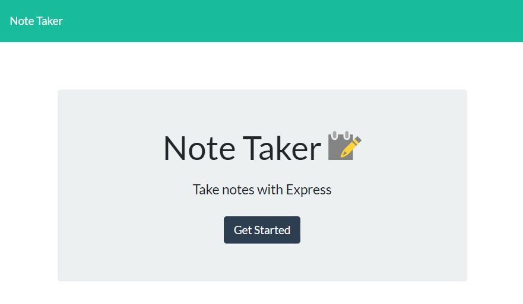
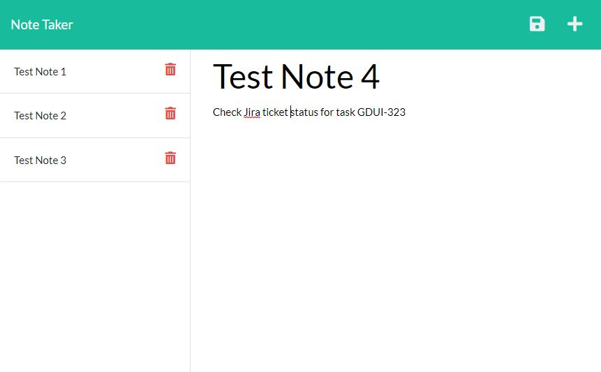

# Note-Taker 

A remotely hosted note taking application. A Node.js Express application hosted remotely on the Heroku platform. Allows user input for a list of notes, to-do's or shopping list items. The list items persist in a JSON format database, and can be deleted when complete.

# Link to Deployed Application:

https://sleepy-brook-39290.herokuapp.com/

# Link to Github Repository:

https://github.com/mdschenck/Note-Taker

# Descripion:

This application utilizes Node.js Express and Router functions to create a note taking application that takes user input and stores the data in a JSON remotely hosted database. The application uses routes to determine HTML output as well as API routes to call the notes from storage, add a new note, and delete note. This application is hosted on the Heroku remote hosting platform, which allows hosting the front end as well as back end server components as well as the database itself.

# Screenshots of the application in use:

Welcome Screen:

Notes Screen:

# User Story

- AS A small business owner
- I WANT to be able to write and save notes
- SO THAT I can organize my thoughts and keep track of tasks I need to complete

# Acceptance Criteria

- GIVEN a note-taking application
- WHEN I open the Note Taker
- THEN I am presented with a landing page with a link to a notes page
- WHEN I click on the link to the notes page
- THEN I am presented with a page with existing notes listed in the left-hand column, plus empty fields to enter a new note title and the note’s text in the right-hand column
- WHEN I enter a new note title and the note’s text
- THEN a Save icon appears in the navigation at the top of the page
- WHEN I click on the Save icon
- THEN the new note I have entered is saved and appears in the left-hand column with the other existing notes
- WHEN I click on an existing note in the list in the left-hand column
- THEN that note appears in the right-hand column
- WHEN I click on the Write icon in the navigation at the top of the page
- THEN I am presented with empty fields to enter a new note title and the note’s text in the right-hand column

# License

MIT - https://opensource.org/licenses/MIT
